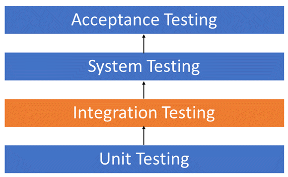

# Fluent Test Scaffold
Fluent Test Scaffold is intended to help with setting up test data for Integration Tests. It allows you to build a Test Scaffold using a Fluent API of predefined builders to seed data or initialise services.

## Why?


When a scenario requires testing multiple components working together then we are writing Integration Tests.
We often mistake Integration Tests for Unit tests.

These are generally higher level components that together make up a more complicated workflow. The can often be difficult to create dependancies that often lead to external integrations like the Database. 
Due to these complexities we often mock these services instead. This can lead to both false positives and false negatives unless you mock the service to respond exactly the same as it would normally for all methods internal uses of the service.

The Test Scaffold aims to setup your services in an environment that matches how it would run normally. 
This includes using an IOC container to register and resolve dependencies and a Database Builders to setup your DBContext.

By setting up the Data Structures in your tests the same way that they are used in production, we can initialize the dependant services in the same manner or with minimal mocking to give a better, more accurate coverage of your code.

## Example

```csharp
[Test]
    public void ComponentIntegrationTest_UserCanAddToCart()
    {
        using var dbContext = TestDbContextFactory.Create();
        
        var email = "Jim@test.com";
        var password = "SupperSecretPa$$word";
        
        // Arrange
        var userId = Guid.Parse("A5A743C3-A02F-4CA3-94F8-B0ECAF4A6345");
        var testScaffold = new TestScaffold()
            .UseAutofac(ctx =>
            {
                ctx.Container.Register(_ => dbContext).SingleInstance();
                ctx.Container.RegisterType<AuthService>().As<IAuthService>();
                ctx.Container.Register(c =>
                    {
                        var requestContext = new UserRequestContext(c.Resolve<IAuthService>());
                        requestContext.AuthenticateUser(email, password);
                        return requestContext;
                    })
                    .As<IUserRequestContext>()
                    .InstancePerLifetimeScope();
                ctx.Container.RegisterType<ShoppingCartService>();
            })
            .UsingBuilder<InventoryBuilder>()
            .WithDataTemplate(ApplicationTemplates.DefaultCatalogueTemplate)
            .WithDefaultCatalogue()
            .With(new User(
                id: userId,
                email: email,
                password: password,
                name: "Jimmy",
                dateOfBirth: DateOnly.FromDateTime(DateTime.Now.AddYears(-8))
            ))
            .WithShoppingCart(userId)
            .Build();
        
        var item = dbContext.Items.FirstOrDefault(i => i.Title == Defaults.CatalogueItems.DeadPool);
        
        // Act
        var shoppingCartService = testScaffold.Resolve<ShoppingCartService>();
        shoppingCartService.AddItemToCart(item!.Id);
        
        // Assert      
        var cart = dbContext.ShoppingCart.Include(s => s.Inventory).FirstOrDefault(u => u.UserId == userId);
        Assert.IsTrue(cart?.Inventory.Any(i => i.Id == item.Id));
    }
```

## Extensibility 
Fluent Test Scaffold was designed to be framework independent to allow for extensibility. 

The internal IOC can be replaced with an IOC framework that supports standard .net `IServiceProviderFactory`

The Base Builder class, while intended to be used to build up a Database is DB independent. A builder could technically be used to build other context required for your tests, such as a file.

The current implementation supports `.net` & `Autofac` for IOC and `Entity Framework Core` for the Database Builders.  

## Documentation
<!--- Add a README.md to a folder for your feature's docs --->
* [Setup](setup.md)
* [Ioc](ioc) - IOC container used by the TestScaffold. 
* [Builders](builders) - builders are used to build up the Test Scaffold context
* [Data Templates](data-templates) - builders are used to build up the Test Scaffold context
* [Test Context](test-context) - provides a place to share state between Tests, Builders and Data Templates
* [Config & Auto Discovery](config-options) - builders are used to build up the Test Scaffold context

## Extensions
* [FluentTestScaffold.Bdd](bdd) - Adds BDD style fluent api to the TestScaffold
* [ASP.Net Core](asp-net-core) - Write Controller Integration Tests including the full ASP.net stack for Auth Tests 

<!---
Excluding Assembly References for now until we can Auto Generate their API docs. 
This should show what Method Signatures are available with the fluent api.

## Assembly Reference
* [FluentTestScaffold.Core](FluentTestScaffold.Core)
* [FluentTestScaffold.Autofac](FluentTestScaffold.Autofac)
* [FluentTestScaffold.EntityFrameworkCore](FluentTestScaffold.EntityFrameworkCore)
* [FluentTestScaffold.Bdd](FluentTestScaffold.Bdd)
* [FluentTestScaffold.AspNetCore](FluentTestScaffold.AspNetCore)
-->