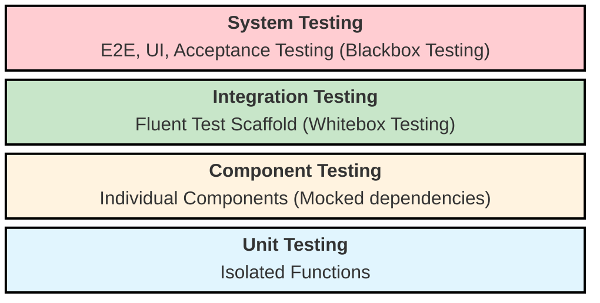
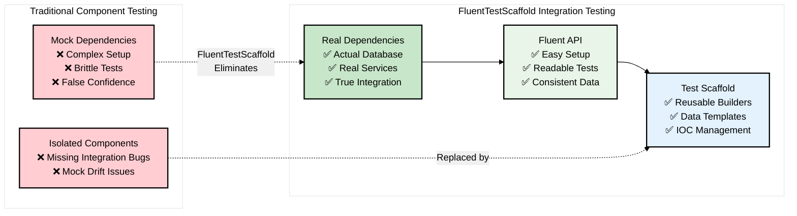

# Fluent Test Scaffold
Fluent Test Scaffold is intended to help with setting up test data for Integration Tests. It allows you to build a Test Scaffold using a Fluent API of predefined builders to seed data or initialise services.

## Testing Pyramid


The Testing Pyramid is a concept that describes the different levels of testing in software development. It emphasizes the importance of having a solid foundation of unit tests, followed by integration tests, and finally end-to-end (E2E) tests. Generally, the higher up the pyramid you go, the more complex and time-consuming the tests become.

Integration tests fit in the middle where they provide more realistic coverage but are often difficult to set up and maintain. **Fluent Test Scaffold** aims to simplify the integration testing process by providing a structured way to set up your test environment and dependencies.
## FluentTestScaffold Benefits vs Traditional Mocking



Integration Tests are often mistaken for Unit tests. Integration Tests focus on testing the interaction between components that together make up a more complicated workflow. They can often be difficult to create due to their dependencies that often lead to external integrations like a Database.
Due to these complexities we often mock these services instead. This can lead to both false positives and false negatives unless you mock the service to respond exactly the same as it would normally.

The Test Scaffold aims to assist with the setup your services in an environment that matches how it would run normally.
This includes using an IOC container to register and resolve dependencies and a Database Builders to help initialise your database state.

By setting up the Data Structures in your tests the same way that they are used in production, we can initialize any dependant services in the same manner or with minimal mocking to give a more realistic representation of how your application would run.

## Installation

```bash
# Install the core package
dotnet add package FluentTestScaffold.Core

# Install framework-specific package
dotnet add package FluentTestScaffold.Nunit
```

## Packages

| Package | Description |
|---------|-------------|
| `FluentTestScaffold.Core` | Core framework and interfaces |
| `FluentTestScaffold.AspNetCore` | ASP.NET Core integration |
| `FluentTestScaffold.Autofac` | Autofac DI container support |
| `FluentTestScaffold.Bdd` | BDD testing support |
| `FluentTestScaffold.EntityFrameworkCore` | Entity Framework Core support |
| `FluentTestScaffold.Nunit` | NUnit testing framework support |

## Example

```csharp
[Test]
    public void ComponentIntegrationTest_UserCanAddToCart()
    {
        using var dbContext = TestDbContextFactory.Create();

        var email = "Jim@test.com";
        var password = "SupperSecretPa$$word";


        // Arrange
        var userId = Guid.Parse("A5A743C3-A02F-4CA3-94F8-B0ECAF4A6345");
        var testScaffold = new TestScaffold()
            .UseAutofac(ctx =>
            {
                ctx.Container.Register(_ => dbContext).SingleInstance();
                ctx.Container.RegisterType<AuthService>().As<IAuthService>();
                ctx.Container.Register(c =>
                    {
                        var requestContext = new UserRequestContext(c.Resolve<IAuthService>());
                        requestContext.AuthenticateUser(email, password);
                        return requestContext;
                    })
                    .As<IUserRequestContext>()
                    .InstancePerLifetimeScope();
                ctx.Container.RegisterType<ShoppingCartService>();
            })
            .UsingBuilder<InventoryBuilder>()
            .WithTemplate("DefaultCatalogueTemplate")
            .WithDefaultCatalogue()
            .With(new User(
                id: userId,
                email: email,
                password: password,
                name: "Jimmy",
                dateOfBirth: DateOnly.FromDateTime(DateTime.Now.AddYears(-8))
            ))
            .WithShoppingCart(userId)
            .Build();

        var item = dbContext.Items.FirstOrDefault(i => i.Title == Defaults.CatalogueItems.DeadPool);

        // Act
        var shoppingCartService = testScaffold.Resolve<ShoppingCartService>();
        shoppingCartService.AddItemToCart(item!.Id);

        // Assert
        var cart = dbContext.ShoppingCart.Include(s => s.Inventory).FirstOrDefault(u => u.UserId == userId);
        Assert.IsTrue(cart?.Inventory.Any(i => i.Id == item.Id));
    }
```

## Architecture Overview

```mermaid
%%{init: {'theme':'base', 'themeVariables': {'primaryColor':'#ffffff','primaryTextColor':'#000000','primaryBorderColor':'#000000','lineColor':'#000000','secondaryColor':'#f0f0f0','tertiaryColor':'#ffffff'}}}%%
flowchart TB
    subgraph "FluentTestScaffold Core Architecture"
        TS[TestScaffold<br/>Entry Point] --> IOC[IOC Container<br/>.NET/Autofac]
        TS --> TSC[TestScaffoldContext<br/>Shared State]
        TS --> DT[Data Templates<br/>Preset Configurations]

        IOC --> B1[Builder A<br/>Database Setup]
        IOC --> B2[Builder B<br/>Service Config]
        IOC --> B3[Builder N<br/>Custom Logic]
        
        B1 --> TSC
        B2 --> TSC
        B3 --> TSC
        
        DT --> B1
        DT --> B2
        DT --> B3
        
        TSC --> TEST[Your Integration Test]
        IOC --> TEST
    end
    
    subgraph "Fluent API Flow"
        START[new TestScaffold] --> SETUP[UseIoc/UseAutofac]
        SETUP --> BUILDER[UsingBuilder T]
        BUILDER --> ACTIONS[With/WithRange/Custom]
        ACTIONS --> BUILD[Build]
        BUILD --> RESOLVE[Resolve Services]
        RESOLVE --> EXECUTE[Execute Test]
    end
    
    style TS fill:#e1f5fe,stroke:#000,stroke-width:2px,color:#000
    style IOC fill:#f3e5f5,stroke:#000,stroke-width:2px,color:#000
    style TSC fill:#e8f5e8,stroke:#000,stroke-width:2px,color:#000
    style DT fill:#fff3e0,stroke:#000,stroke-width:2px,color:#000
    style TEST fill:#ffebee,stroke:#000,stroke-width:2px,color:#000
    style B1 fill:#e8f5e8,stroke:#000,stroke-width:2px,color:#000
    style B2 fill:#e8f5e8,stroke:#000,stroke-width:2px,color:#000
    style B3 fill:#e8f5e8,stroke:#000,stroke-width:2px,color:#000
    style START fill:#e3f2fd,stroke:#000,stroke-width:2px,color:#000
    style SETUP fill:#fff3e0,stroke:#000,stroke-width:2px,color:#000
    style BUILDER fill:#e8f5e8,stroke:#000,stroke-width:2px,color:#000
    style ACTIONS fill:#f3e5f5,stroke:#000,stroke-width:2px,color:#000
    style BUILD fill:#ffebee,stroke:#000,stroke-width:2px,color:#000
    style RESOLVE fill:#e1f5fe,stroke:#000,stroke-width:2px,color:#000
    style EXECUTE fill:#c8e6c9,stroke:#000,stroke-width:2px,color:#000
```



## Fluent API Core Concepts

FluentTestScaffold provides a fluent API that enables method chaining to build complex test scenarios with minimal setup code. The API follows a logical flow from initialization through configuration to execution.

### Entry Point & Initialization

```csharp
// Start with TestScaffold constructor
var testScaffold = new TestScaffold()
```

The `TestScaffold` class serves as the main entry point and orchestrates the entire fluent API workflow.

### IOC Container Setup

```csharp
// .NET Default IOC Container
.UseIoc(services => {
    services.AddSingleton<IMyService, MyService>();
    services.AddTransient<IRepository, Repository>();
})

// Autofac IOC Container  
.UseAutofac(ctx => {
    ctx.Container.RegisterType<MyService>().As<IMyService>();
    ctx.Container.Register(_ => dbContext).SingleInstance();
})
```

**Key Methods:**
- `UseIoc(Action<IServiceCollection>)` - Configure .NET's built-in dependency injection
- `UseAutofac(Action<AutofacServiceBuilder>)` - Configure Autofac container with advanced features

### Builder Pattern & Data Setup

```csharp
// Switch to specific builders for data setup
.UsingBuilder<UserBuilder>()
.With(new User { Name = "John", Email = "john@test.com" })
.WithRange(users)

.UsingBuilder<ProductBuilder>()  
.WithDefaultProducts()
.With(new Product { Name = "Widget", Price = 10.99m })
```

**Key Methods:**
- `UsingBuilder<T>()` - Resolve and switch to a specific builder type
- `With(entity)` - Add a single entity to the test context
- `WithRange(entities)` - Add multiple entities at once
- `WithDefault*()` - Apply predefined default data sets (custom builder methods like `WithDefaultProducts()`)

### Data Templates & Presets

```csharp
// Apply predefined data configurations
.WithTemplate("DefaultCatalogueTemplate")
.WithTemplate("UserWithOrders", userId)
```

**Key Methods:**
- `WithTemplate(name)` - Apply a named data template
- `WithTemplate(name, parameters)` - Apply named template with parameters

### Build & Service Resolution

```csharp
// Finalize setup and resolve services
.Build();

// Resolve services from IOC container
var userService = testScaffold.Resolve<IUserService>();
var repository = testScaffold.Resolve<IUserRepository>();
```

**Key Methods:**
- `Build()` - Finalize the test scaffold configuration and build the IOC container
- `Resolve<T>()` - Get services from the configured IOC container

### Method Chaining Flow

```mermaid
%%{init: {'theme':'base', 'themeVariables': {'primaryColor':'#ffffff','primaryTextColor':'#000000','primaryBorderColor':'#000000','lineColor':'#000000','secondaryColor':'#f0f0f0','tertiaryColor':'#ffffff'}}}%%
flowchart LR
    NEW[new TestScaffold] --> IOC[UseIoc/UseAutofac]
    IOC --> BUILDER[UsingBuilder T]
    BUILDER --> DATA[With/WithRange/WithDefault]
    DATA --> TEMPLATE[WithTemplate]
    TEMPLATE --> BUILD[Build]
    BUILD --> RESOLVE[Resolve T]
    
    BUILDER -.->|"Switch Context"| BUILDER2[UsingBuilder U]
    BUILDER2 --> DATA2[With/WithRange]
    DATA2 --> TEMPLATE
    
    style NEW fill:#e3f2fd,stroke:#000,stroke-width:2px,color:#000
    style IOC fill:#fff3e0,stroke:#000,stroke-width:2px,color:#000
    style BUILDER fill:#e8f5e8,stroke:#000,stroke-width:2px,color:#000
    style BUILDER2 fill:#e8f5e8,stroke:#000,stroke-width:2px,color:#000
    style DATA fill:#f3e5f5,stroke:#000,stroke-width:2px,color:#000
    style DATA2 fill:#f3e5f5,stroke:#000,stroke-width:2px,color:#000
    style TEMPLATE fill:#e1f5fe,stroke:#000,stroke-width:2px,color:#000
    style BUILD fill:#ffebee,stroke:#000,stroke-width:2px,color:#000
    style RESOLVE fill:#c8e6c9,stroke:#000,stroke-width:2px,color:#000
```



### BDD Extensions (Optional)

```csharp
// Behavior-Driven Development style API
testScaffold
    .Scenario("User can add items to cart")
    .Given(scaffold => scaffold.UsingBuilder<UserBuilder>().WithDefaultUser())
    .When(scaffold => {
        var cartService = scaffold.Resolve<ICartService>();
        cartService.AddItem(productId);
    })
    .Then(scaffold => {
        var cart = scaffold.Resolve<ICartRepository>().GetCart(userId);
        Assert.IsTrue(cart.Items.Any(i => i.ProductId == productId));
    });
```

**BDD Methods:**
- `Scenario(description)` - Define test scenario description
- `Given(setup)` - Setup test preconditions
- `When(action)` - Execute the action under test  
- `Then(assertion)` - Verify expected outcomes

### Context Sharing

The `TestScaffoldContext` allows sharing data between builders, templates, and tests:

```csharp
// In a builder
Context.Set("UserId", userId);

// In another builder or test
var userId = Context.Get<Guid>("UserId");
```

### Complete Example

```csharp
var testScaffold = new TestScaffold()
    .UseAutofac(ctx => {
        ctx.Container.Register(_ => dbContext).SingleInstance();
        ctx.Container.RegisterType<UserService>().As<IUserService>();
    })
    .UsingBuilder<UserBuilder>()
    .WithTemplate("StandardUser")
    .With(new User { Email = "test@example.com" })
    .UsingBuilder<ProductBuilder>()
    .WithDefaultProducts()
    .Build();

var userService = testScaffold.Resolve<IUserService>();
// Execute test logic...
```

## Extensibility
Fluent Test Scaffold was designed to be framework independent to allow for extensibility. 

The internal IOC can be replaced with an IOC framework that supports standard .net `IServiceProviderFactory`

The Base Builder class, while intended to be used to build up a Database is DB independent. A builder could technically be used to build other context required for your tests, such as a file.

The current implementation supports `.net` & `Autofac` for IOC and `Entity Framework Core` for the Database Builders.  

## CI/CD Setup

This project uses GitHub Actions for continuous integration and deployment with release tag-based versioning. The CI/CD pipeline includes:

### Workflows

1. **PR Check (`pr-check.yml`)**: Runs on pull requests
   - Checks code formatting and linting rules
   - Builds and tests on .NET 8.0 with multi-targeting (6.0, 7.0, 8.0)
   - Validates package dependencies and checks for vulnerabilities
   - Ensures minimum code coverage (48%)
   - Runs performance tests for regression detection

2. **CD (`cd.yml`)**: Runs on published releases
   - Extracts version from release tag (e.g., `v1.0.0`)
   - Builds and validates packages with tag-based versioning
   - **Requires manual approval** via GitHub environments before publishing
   - Publishes to NuGet.org (not GitHub Packages)
   - Updates release status after successful deployment

3. **CodeQL**: Automated security scanning
   - Runs static analysis for security vulnerabilities
   - Integrated with GitHub Security tab

### Required Secrets & Environment Setup

To use the CI/CD pipeline, you need to configure:

1. **GitHub Environments**: Create `production` and `nuget-production` environments with protection rules requiring manual approval
2. **`NUGET_API_KEY`**: Your NuGet.org API key for publishing packages
3. **`GITHUB_TOKEN`**: Automatically provided by GitHub Actions

### Release Process

1. **Create a release from main branch**:
   ```bash
   # Ensure you're on main branch
   git checkout main
   git pull origin main
   
   # Create and push release tag
   git tag v1.0.0
   git push origin v1.0.0
   
   # Create GitHub release (triggers CD workflow)
   gh release create v1.0.0 --title "Release v1.0.0" --notes "Release notes here"
   ```

2. **The CI/CD pipeline will**:
   - Validate the release is from main branch
   - Build all packages with version extracted from tag
   - Run all tests and security scans
   - **Wait for manual approval** via GitHub environments
   - Publish to NuGet.org after approval
   - Update release status

For detailed CI/CD setup instructions, see [CI/CD Setup Guide](ci-cd-setup.md).

## Documentation
<!--- Add a README.md to a folder for your feature's docs --->
* [Setup](setup.md)
* [CI/CD Setup](ci-cd-setup.md) - Continuous Integration and Deployment setup
* [Ioc](ioc) - IOC container used by the TestScaffold. 
* [Builders](builders) - builders are used to build up the Test Scaffold context
* [Data Templates](data-templates) - builders are used to build up the Test Scaffold context
* [Test Context](test-context) - provides a place to share state between Tests, Builders and Data Templates
* [Config & Auto Discovery](config-options) - builders are used to build up the Test Scaffold context

## Extensions
* [FluentTestScaffold.Bdd](bdd) - Adds BDD style fluent api to the TestScaffold
* [ASP.Net Core](asp-net-core) - Write Controller Integration Tests including the full ASP.net stack for Auth Tests 

<!---
Excluding Assembly References for now until we can Auto Generate their API docs. 
This should show what Method Signatures are available with the fluent api.

## Assembly Reference
* [FluentTestScaffold.Core](FluentTestScaffold.Core)
* [FluentTestScaffold.Autofac](FluentTestScaffold.Autofac)
* [FluentTestScaffold.EntityFrameworkCore](FluentTestScaffold.EntityFrameworkCore)
* [FluentTestScaffold.Bdd](FluentTestScaffold.Bdd)
* [FluentTestScaffold.AspNetCore](FluentTestScaffold.AspNetCore)
-->
