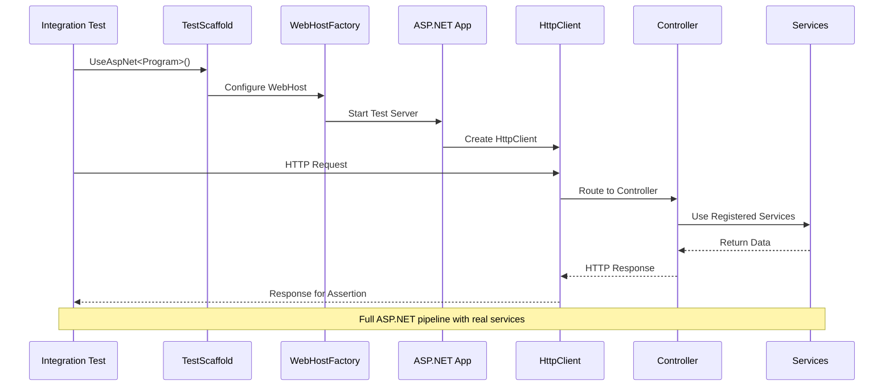

# ASP.Net Core

The ASP.Net Core extension allows you to write Integration Tests for your Controllers including the full ASP.net stack for Auth Tests.

## ASP.NET Core Integration Flow



## Integration testing with an ASP.Net core application

TestScaffold can be used to make testing an ASP.Net core application easier. The following is a list of steps to build a simple test. It follows the article [Integration tests in ASP.NET Core](https://learn.microsoft.com/en-us/aspnet/core/test/integration-tests?view=aspnetcore-8.0).

### Required nuget packages

You will need to bring in the following nuget packages:
- FluentTestScaffold.Core (FluentTestScaffold.Core)
- FluentTestScaffold.EntityFrameworkCore (optional)
- FluentTestScaffold.AspNetCore

Also add any other nuget packages for assertions or mocking as required.

### Making sure your ASP.Net core project is ready

FluentTestScaffold.AspNetCore under the hood uses [Microsoft.AspNetCore.Mvc.Testing](https://www.nuget.org/packages/Microsoft.AspNetCore.Mvc.Testing) to help test your web application. As such it requires that access to the Program class (entry point) of your web application, to make it accessible make the following changes to your Program.cs file:

```csharp
var builder = WebApplication.CreateBuilder(args);
// ... Configure services, routes, etc.
app.Run();

// Add the following line to the end of the Program.cs file
public partial class Program { }
```

### Creating a TestScaffold with ASP.NET Core

To create and populate your TestScaffold with ASP.NET Core integration, simply do the following:

```csharp
private TestScaffold testScaffold;

// Your test's setup code
public void Setup()
{
    testScaffold = new TestScaffold()
        .UseAspNet<Program>();
}
```

This will setup the TestScaffold's internal service provider to be the same as your ASP.NET Core application.

### Overriding services with Mock or Test services

To override existing services with a mock or testing service, or to replace a DbContext with an in-memory DbContext, you can pass a configuration action:

```csharp
testScaffold = new TestScaffold()
    .UseAspNet<Program>(services =>
    {
        // replacing a service registration with a mock
        services.ReplaceServiceWithMock<IEmailService>(mockEmailService);

        // replacing a DbContext registration with an inmemory database
        services.ReplaceDbContextWithInMemoryProvider<MyApplicationDbContext>();
    });
```

### Populating your In-memory database with test data

If you have replaced your dbcontext registration with an in-memory database, you can populate it with data using the ```WithData``` extension method on your ```TestScaffold```.

```csharp
testScaffold.WithData<MyApplicationDbContext, Employee>(
    new Employee
    {
        Id = 1,
        Name = "John Doe"
    }
);
```

### Performing an action to test and asserting

You can now test api calls to your Web Application using the Test Scaffold. To do this you will need to get a Http Client which is used to talk to the Web Application.

```csharp
var httpClient = testScaffold.GetWebApplicationHttpClient<Program>();

var response = await httpClient.PostAsJsonAsync<AddNumbers>(
    "/maths/add",
    new AddNumbers
    {
        A = 12,
        B = 2
    }
);
```

To assert the results of the action:

```csharp
// assert 200 response
response.StatusCode.Should().Be(HttpStatusCode.Ok);

// extract the response message and assertions
var answer = await response.Content.ReadFromJsonAsync<Answer>();
answer.Result
    .Should()
    .Be(14);
```

### Session states are maintained for the Http Client

Make sure you use the Test Scaffold's extension method ```GetWebApplicationHttpClient<TEntryPoint>()``` to get your Http Client so session states and cookies are maintained between web requests. This will make sure things like Authentication cookies are maintained correctly in your tests.

```csharp
var httpClient = testScaffold.GetWebApplicationHttpClient<Program>();

// Initial unauthenticated call is expected to fail
var response = await httpClient.PostAsJson<Sensitive>(
    "/test/sensitive",
    new Sensitive { ... }
);

response.StatusCode.Should().Be(HttpStatusCode.Unauthorized);

// Perform a successful login request to set the Authentication cookie
await httpClient.PostAsJson<Login>(
    "/authentication/login",
    new Login
    {
        Username = "testuser",
        Password = "Password123!"
    }
);

// New authenticated call is expected to pass as the request is now authenticated
response = await httpClient.PostAsJson<Sensitive>(
    "/test/sensitive",
    new Sensitive { ... }
);

response.StatusCode.Should().Be(HttpStatusCode.Ok);
```
