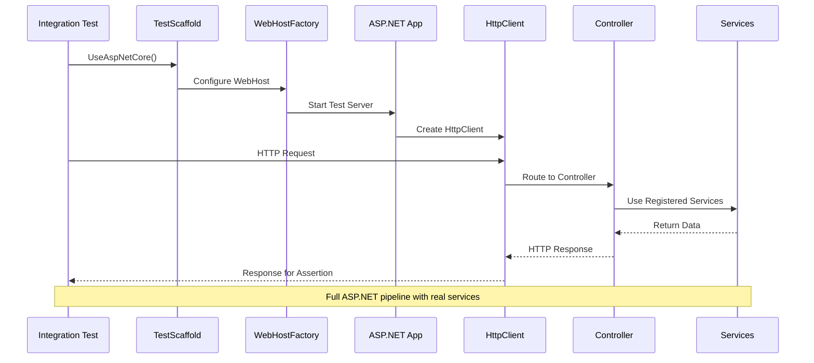

# ASP.Net Core

The ASP.Net Core extension allows you to write Integration Tests for your Controllers including the full ASP.net stack for Auth Tests.

## ASP.NET Core Integration Flow



## Integration testing with an ASP.Net core application

TestScaffold can be used to make testing an ASP.Net core application easier.  The following is a list of steps to build a simple test.  If follows the article [Integration tests in ASP.NET Core](https://learn.microsoft.com/en-us/aspnet/core/test/integration-tests?view=aspnetcore-8.0).

### Required nuget packages

You will need to bring in the following nuget packages:
- FluentTestScaffold.Core (FluentTestScaffold.Core)
- FluentTestScaffold.EntityFrameworkCore (optional)
- FluentTestScaffold.AspNetCore

Also add any other nuget packages for assertions or mocking as required.

### Making sure your ASP.Net core project is ready

FluentTestScaffold.AspNetCore under the hood uses [Microsoft.AspNetCore.Mvc.Testing](https://www.nuget.org/packages/Microsoft.AspNetCore.Mvc.Testing) to help test your web application.  As such it requires that access to the Program class (entry point) of your web application, to make it accessible make the following changes to your Program.cs file:

```csharp
var builder = WebApplication.CreateBuilder(args);
// ... Configure services, routes, etc.
app.Run();

// Add the following line to the end of the Program.cs file
public partial class Program { }
```

### Creating a Web Application Factory

A web application factory is required to build your tests.  It is the mechanism used to create a Http Client that Microsoft.AspNewCore.Mvc.Testing will use to talk to your code.

To create the Web Application Factory simply create a class the inherits from the generic WebApplicationFactory passing in your Program class as the generic parameter.

```csharp
public class MyWebApplicationFactory: WebApplicationFactory<Program>
{
}
```

### Overriding defaults of you web application

Sometimes you may need to override things like the configuration or injected services of your web application.  You can do this by providing an override to the method ```ConfigureWebHost``` of your web application factory, depending on the what needs to be overridden call extension methods ```ConfigureAppConfiguration``` and/or ```ConfigureTestServices``` against the incoming ```IWebHostBuilder ``` object.

```csharp
public class MyWebApplicationFactory: WebApplicationFactory<Program>
{
    protected override void ConfigureWebHost(IWebHostBuilder builder)
    {
        /// here you will use the builder to make changes to the web host before you start testing
        builder.ConfigureAppConfiguration(configurationBuilder =>
        {
            // override configurations
        });

        builder.ConfigureTestServices(services =>
        {
            // override service registrations, eg. replace registration of interfaces to concrete types with mocks.
        });
    }
}
```

#### Overriding configuration values

To override configuration values with test values call the extension method ```ConfigureAppConfiguration``` on the IWebHostBuilder:

```csharp
public class MyWebApplicationFactory: WebApplicationFactory<Program>
{
    protected override void ConfigureWebHost(IWebHostBuilder builder)
    {
        builder.ConfigureAppConfiguration(configurationBuilder =>
        {
            configurationBuilder.AddInMemoryCollection(
                new Dictionary<string, string?>
                {
                    // Override or provide a test configuration value that is normally provided from a configuration source such as appsettings.json
                    // {
                    //     "Google": {
                    //        "ApiKey": "TestApiKey123456"
                    //     }
                    // }
                    ["Google:ApiKey"] = "TestApiKey123456"
                });
        });
    }
}
```

#### Overriding services with Mock or Test services

To override existing services with a mock or testing service, or to replace a DbContext with an in-memory DbContext call the extension method ```ConfigureTestServices``` on the IWebHostBuilder:

```csharp
public class MyWebApplicationFactory: WebApplicationFactory<Program>
{
    // Make sure your mocks are public so you can easily access them for Setup or Verifications steps in your tests
    public Mock<IEmailService> mockEmailService = new Mock<IEmailService>()

    protected override void ConfigureWebHost(IWebHostBuilder builder)
    {
        builder.ConfigureTestServices(services =>
        {
            // replacing a service registration with a mock
            services.ReplaceServiceWithMock<IEmailService>(mockEmailService);

            // replacing an DbContext registration with an inmemory daabase
            services.ReplaceDbContextWithInMemoryProvider<MyApplicationDbContext>();
        });
    }
}
```

### Creating a TestScaffold with your Web Application Factory

To create and populate your TestScaffold with your Web Application Factory simply do the following:

```csharp
private TestScaffold testScaffold;

// You test's setup code
public void Setup()
{
    var webFactory = new MyWebApplicationFactory();

    testScaffold = new TestScaffold()
        .UseAspNet<MyWebApplicationFactory, Program>(webFactory);
}
```

This will setup the TestScaffold's internal service provider to be the same as your Web Application Factory.

### Populating your In-memory database with test data

If you have replaced your dbcontext registration with an in-memory database, your can populate it with data using the ```WithData``` extension method on your ```TestScaffold```.

```csharp
testScaffold.WithData<MyApplicationDbContext, Employee>(
    new Employee
    {
        Id = 1,
        Name = "John Doe"
    }
);
```

### Performing an action to test and asserting

You can now test api calls to your Web Application using the Test Scaffold.  To do this you will need to get a Http Client
which is used to talk to the Web Application.

```csharp
var httpClient = testScaffold.GetWebApplicationHttpClient<MyWebApplicationFactory, Program>();

var response = await httpClient.PostAsJsonAsync<AddNumbers>(
    "/maths/add",
    new AddNumbers
    {
        A = 12,
        B = 2
    }
);
```

To assert the results of the action:

```csharp
// assert 200 reponse
response.StatusCode.Should().Be(HttpStatusCode.Ok);

// extraction the response message and assertions
var answer = await response.Content.ReadFromJsonAsync<Answer>();
answer.Result
    .Should()
    .Be(14);
```

### Setting up mocks

To make setting up mocks easy make sure you declare them as public in your web application factory. See [Overriding services with Mock or Test services](Overriding services with Mock or Test services).

```csharp
var webApplicationFactory = testScaffold.TestScaffoldContext.Get<MyWebApplicationFactory>();

// Setup our mock email service so that when it is called in our code it returns true for successfully sent
webApplicationFactory.mockEmailService
    .Setup(es => es.Send(It.IsAny<Email>())
    .ReturnsAsync(true);
```

To verify a mock is called when an action is performed:

```csharp
var httpClient = testScaffold.GetWebApplicationHttpClient<MyWebApplicationFactory, Program>();

// Perform an action to test
var response = await httpClient.PostAsJsonAsync<RegisterUser>(
    "/user/register",
    new RegisterUser
    {
        Email = "testuser@email.com"
    }
);

var webApplicationFactory = testScaffold.TestScaffoldContext.Get<MyWebApplicationFactory>();

// Verify an email was sent to the test user's email address with the correct subject line
webApplicationFactory.mockEmailService
    .Verify(
        es => es.Send(It.Is<Email>(email => email.To == "testuser@email.com" && email.Subject == "Your user registration was successful"),
        Times.Once
    );
```

### Session states are maintained for the Http Client

Make sure you use the Test Scaffold's extension method ```GetWebApplicationHttpClient<TApplicationFactory, TProgram>``` to get your Http Client so session states and cookies are maintain between web requests.  This will make sure things like Authentication cookies are maintained correctly in your tests.

```csharp
var httpClient = testScaffold.GetWebApplicationHttpClient<MyWebApplicationFactory, Program>();

// Initial unathenticated call is expected to fail
var response = await httpClient.PostAsJson<Sensitive>(
    "/test/sensitive",
    new Sensitive { ... }
);

response.StatusCode.Should().Be(HttpStatusCode.Unauthorized);

// Perform a successful login request to set the Authentication cookie
await httpClient.PostAsJson<Login>(
    "/authentication/login",
    new Login
    {
        Username = "testuser",
        Password = "Password123!"
    }
);

// New authenticated call is expected to pass as the request is now authenticated
response = await httpClient.PostAsJson<Sensitive>(
    "/test/sensitive",
    new Sensitive { ... }
);

response.StatusCode.Should().Be(HttpStatusCode.Ok);
```
