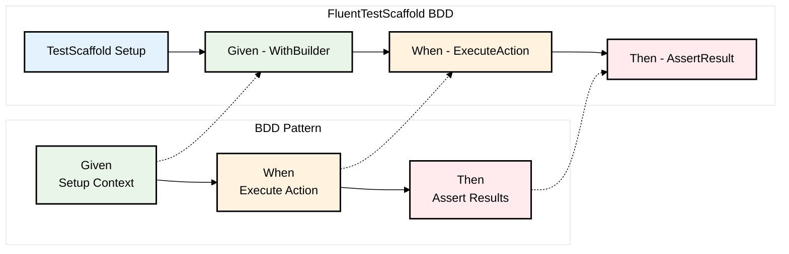

# BDD

The BDD extension adds BDD style fluent api to the TestScaffold.

## BDD Workflow



## Behaviour Driven Development API

`TestScaffold.Bdd` adds basic support for BDD style tests to the TestScaffold. 
It exposes a Fluent API to be able to define your Test using BDD style syntax.

After your Test Scaffold is built, use the BDD API to define your tests

```csharp
      var testScaffold = new TestScaffold()
            // Will be use to log scenario steps
            .UsingNunit()
            .UseIoc(new AppServicesBuilder())
            .WithTemplate(new DefaultCatalogueTemplate())
            .Build();

        testScaffold
            .Scenario("User can not add age restricted item to cart when under aged")
            .Given<IUserRequestContext>("A user is authenticated", AUserIsAuthenticated)
            .When("The user attempts to add an item to the shopping cart", WhenTheUserAddsItemToCart)
            .Then("The user should not be able to add the item to the shopping cart", ThenTheUserCanNotAddAgeRestrictedContent);
```

### Logging
The Bdd API adds Logging to the TestScaffold to log the steps of the scenario. To see improves Test Results use the TestScaffold.Nunit extension to log the steps to the NUnit Test Results.

Note: `UseingNunit` should be called before `UseIoc` to ensure the logging is setup correctly.
```csharp
      var testScaffold = new TestScaffold()
            // Will be use to log scenario steps
            .UsingNunit()
            .UseIoc(new AppServicesBuilder());
```

### Exception Handling
When an exception is expected to be through the BDD API exposes some methods on the TestScaffold to be able to catch and assert the exception.
```csharp
     testScaffold
            .Scenario("User can not add age restricted item to cart when under aged")
            .Given<IUserRequestContext>("A user is authenticated", requestContext =>
            {
                requestContext.AuthenticateUser(UserBuilder.Under18User.Email,
                    UserBuilder.Under18User.Password);
            })
            .When("The user attempts to add an item to the shopping cart", ts =>
            {
                var dbContext = ts.Resolve<TestDbContext>();
                var item = dbContext.Items.FirstOrDefault(i => i.Title == Defaults.CatalogueItems.DeadPool);
                var shoppingCartService = testScaffold.Resolve<ShoppingCartService>();
                ts.Catch<InvalidOperationException>(() => shoppingCartService.AddItemToCart(item!.Id));
            })
            .Then("The user should not be able to add the item to the shopping cart", ts =>
            {
                // Assert
                ts.Handle<InvalidOperationException>(ex =>
                {
                    Assert.IsNotNull(ex);
                    Assert.AreEqual($"You must be over 15 to add this item", ex.Message);
                });
            });
```  

### What's Next??

- [x] Add Basic Fluent BDD API
- [x] Add Basic Exception Handling 
- [ ] Improve Exception Handling by auto catching exceptions by the BDD methods
- [ ] Add support for BDD Tables/Data Driven tests
- [ ] Add support Better Debug Reporting
- [ ] Add support for Html Reporter
