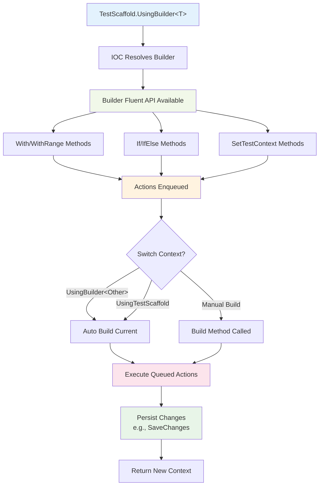
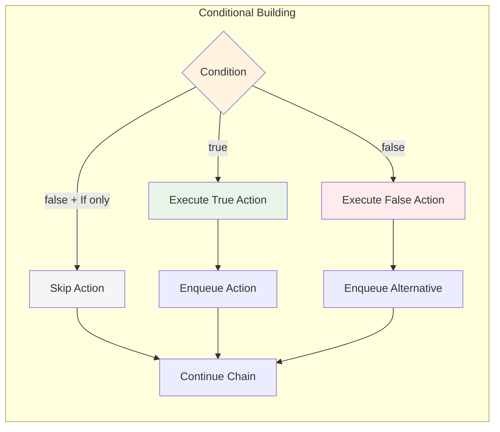

# Builders
Builders enabled the Fluent API and control the Setup for the specific framework the builder is Designed for.

## Builder Workflow



```csharp
        new TestScaffold()
            .UseIoc(ctx => ctx.Container.RegisterSingleton(_ => dbContext))
            .UsingBuilder<EfCoreBuilder<TestDbContext>>()
            .With(new User(
                id: userId,
                email: "Bob@test.com",
                password: "",
                name: "Bob",
                dateOfBirth: DateOnly.FromDateTime(DateTime.Now.AddYears(-15))
            ))
            .Build();

        var user = dbContext.Users.FirstOrDefault(u => u.Id == userId);
```
Builders use deferred execution until the `.Build()` method is called. This will also return the Fluent API back to the `TestScaffold` to allow continuing with other builders.

## Auto Discovery
Builders can be automatically discovered and registered with the IOC Container by using the `AutoDiscovery` feature.

See [Config Options](../config-options/README.md) for more information on Auto Discovery

## Builder Registration and Construction
Builders are registered with the IOC using AutoDiscovery. Any Builder Dependencies should be registered with the IOC Container. These will be injected into the builder when it is constructed.
```csharp
        new TestScaffold()
            .UseIoc(ctx =>
            {
                ctx.Container.RegisterSingleton(_ => dbContext);
            })
            .UsingBuilder<EfCoreBuilder<TestDbContext>>();
```
### Builder Dependencies
If a Builder has any Constructor dependencies they can be registered into the IOC Container.
The IOC Container will resolve these dependencies when using the builder.
eg. The EFCoreBuilder has a dependency on TestDbContext

## Using Builders
Calling `UsingBuilder` on the `TestScaffold` will switch the Fluent API over to the Builders Fluent API.
You can switch back to The TestScaffold by calling `UsingTestScaffold` on a Builder

```csharp
MockService? service;
var testScaffold = new TestScaffold()
      .UseIoc(ctx => ctx.Container.RegisterSingleton(_ => dbContext))
      .UsingBuilder<InventoryBuilder>()
      .WithDefaultCatalogue()
      .UsingTestScaffold()
      .Resolve<MockService>(out service);
```
### Auto Build
When switching between Builders and TestScaffold the `Build` method will be called to ensure the build actions have been applied

For the EFBuiler this will call `SaveChanges` to persist the data to the database.

```csharp
new TestScaffold()
    .UseIoc(ctx => ctx.Container.RegisterSingleton(_ => dbContext))
    .UsingBuilder<UserBuilder>()
    .With(new User(
        id: userId,
        email: "test@email.com"
    ))
    // Swithing to another builder will auto build the previous builder
    .UsingBuilder<InventoryBuilder>()
    .WithDefaultCatalogue()
    // Switching back to TestScaffold will also auto build the previous builder
    .UsingTestScaffold()
```

### Conditional Build Actions



You can conditionally apply actions to a builder by using the `If` or `IfElse` methods.

```csharp
//This will only enqueue and action if the condition is true.
new TestScaffold()
    .UseIoc(ctx => ctx.Container.RegisterSingleton(_ => dbContext))
    .UsingBuilder<UserBuilder>()
    .If(true, b => b.With(new User(
        id: userId,
        email: "test@email.com"
    )))
//This will only enqueue and action if true and an alternative when false.
new TestScaffold()
    .UseIoc(ctx => ctx.Container.RegisterSingleton(_ => dbContext))
    .UsingBuilder<UserBuilder>()
    .IfElse(IsAdmin,
        b => b.With(new User {
            Id: userId,
            Amail: "test@email.com",
            Role = "Admin"
        }),
        b => b.With(new User(
            Id: userId,
            Email: "test@email.com",
        )
```

## Custom Builders
To implement your own Builder they should inherit at minimum the `Builder` class or one of the derived classes.

This will allow you extend the Fluent APi and group common Builder logic.

A Builder method should return `this` to continue the Fluent API

```csharp
public class MockBuilder: Builder
{
    public MockBuilder(IServiceProvider serviceProvider) : base(serviceProvider)
    {
    }

    public MockBuilder WithMockData(List<string> messages)
    {
        messages.Add("Hello World!");
        return this;
    }
}
```

## Database Builders
* [Entity Framework](ef-builder.md)
