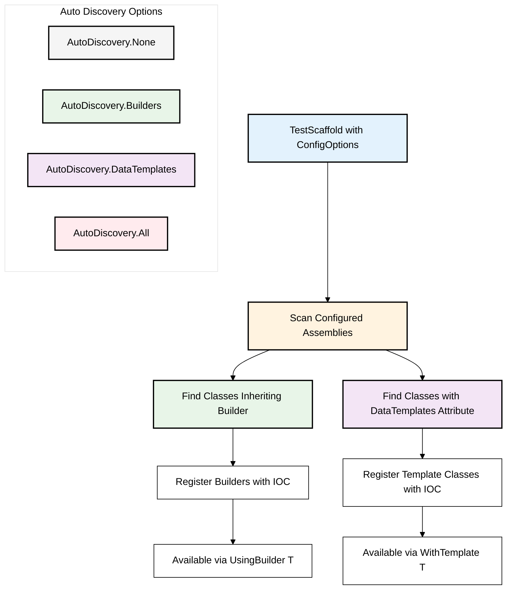

# Config Options & Auto Discovery

Config Options allow you to configure the behaviour of the Test Scaffold.

## Auto Discovery



You can override the default configuration for the Test Scaffold by providing a custom config.
```csharp
new TestScaffold(new ConfigOptions());
```

## Assemblies
A list of Assemblies used during Auto Discovery

*Default:* `AppDomain.CurrentDomain.GetAssemblies()`

## AutoDiscovery
Auto Discovery is a feature that allows you to automatically register all the Builders and/or Data Templates in the specified assemblies.

*Default:* `AutoDiscovery.All`

```csharp
new TestScaffold(new ConfigOptions() {AutoDiscovery = AutoDiscovery.None})
    .UseIoc();
```

During IOC registration the Auto Discovery options will be used to Register any Builders and Data Templates found in the given assemblies

### AutoDiscovery Options
* None - Disables Auto Discovery
* Builders - Enables Discovery for Builders
* DataTemplates - Enables Discovery for DataTemplates (classes marked with `[DataTemplates]` attribute)
* All - Enables discovery for all

### Data Templates Auto Discovery

When `AutoDiscovery.DataTemplates` is enabled, the system will:

1. Scan all configured assemblies for classes marked with the `[DataTemplates]` attribute
2. Register each template class as a singleton in the IOC container
3. Make them available for use with the `WithTemplate<TTemplate>()` method

```csharp
// Enable data template auto discovery
var config = new ConfigOptions 
{
    AutoDiscovery = AutoDiscovery.DataTemplates,
    Assemblies = new List<Assembly> { typeof(MyTemplates).Assembly }
};

var testScaffold = new TestScaffold(config).UseIoc();
```
