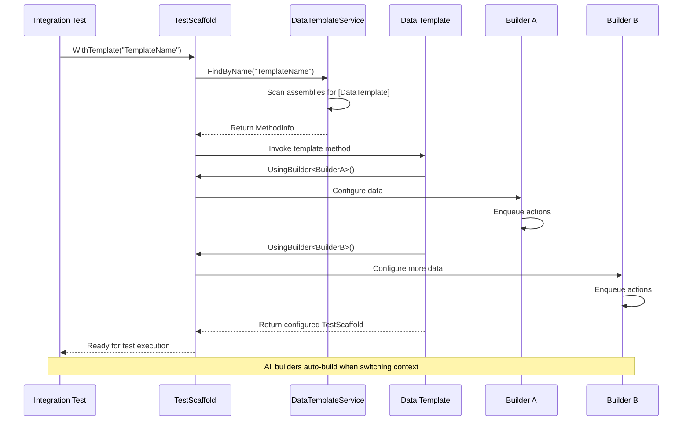

# Data Templates

Data Templates are used to build up the Test Scaffold context large presets of data. 
It allows the use of multiple Builders to build up common data structures.

## Data Template Workflow




## Creating a Data Template

Data Templates are created by implementing the `DataTemplate` Attribute on any Method and ensuring it takes a single `TestScaffold` parameter.
```csharp
    // Match by method name
    [DataTemplate]
    // OR Match by Attribute Name
    [DataTemplate(Name = "Default Catalogue & Users")]
    public TestScaffold DefaultCatalogueAndUsers(TestScaffold testScaffold)
    {
        testScaffold.UsingBuilder<UserBuilder>()
            //Setup standard users
            .WithOver18User(out var over18UserId)
            .WithUnder18User(out var under18UserId)
            //Setup User Shopping Carts
            .WithShoppingCart(under18UserId)
            .WithShoppingCart(over18UserId)
            .Build()
            .UsingBuilder<InventoryBuilder>()
            //Setup Inventory
            .WithRange(new List<Item>()
            {
                new() {Id = Guid.NewGuid(), Title = Defaults.CatalogueItems.Minions, Price = 21},
                new() {Id = Guid.NewGuid(), Title = Defaults.CatalogueItems.Avengers, Price = 24},
                new() {Id = Guid.NewGuid(), Title = Defaults.CatalogueItems.DeadPool, Price = 14, AgeRestriction = 15}
            }).Build();

        return testScaffold;
    }
```
## Registering a Data Template
use the [Auto Discovery](../config-options) feature to register Data Templates

```csharp
new TestScaffold(new ConfigOptions() {AutoDiscovery = AutoDiscovery.DataTemplates})
    .UseIoc();
```

## Using a Data Template
When building the Test Scaffold you can specify the Data Template to use via the `WithTemplate` method. 

This will match the Template name to the name of the method that has the `DataTemplate` attribute or to the Name property of the `DataTemplate` attribute.

```csharp
        var testScaffold = new TestScaffold()
            .UseIoc(new DefaultIocAppServicesBuilder(new ConfigOptions(){ AutoDiscovery = AutoDiscovery.DataTemplates}), 
                ctx =>
                {
                    ctx.Container.AddSingleton(_ =>  TestDbContextFactory.Create());
                    ctx.RegisterAppServices();
                })
            .WithTemplate(nameof(ApplicationTemplates.DefaultCatalogueAndUsers));
```

### Passing Parameters to a Data Template

```mermaid
%%{init: {'theme':'base', 'themeVariables': {'primaryColor':'#ffffff','primaryTextColor':'#000000','primaryBorderColor':'#000000','lineColor':'#000000','secondaryColor':'#f0f0f0','tertiaryColor':'#ffffff'}}}%%
flowchart LR
    subgraph "Parameter Flow"
        TEST[Test Method] --> CALL[WithTemplate<br/>name, param1, param2]
        CALL --> RESOLVE[Resolve Template Method]
        RESOLVE --> PARAMS[Combine TestScaffold + Parameters]
        PARAMS --> INVOKE[Invoke Template Method]
        INVOKE --> EXECUTE[Execute Template Logic]
    end
    
    subgraph "Template Method Signature"
        SIG["[DataTemplate]<br/>Method(TestScaffold ts, int p1, Guid p2, string p3)"]
    end
    
    EXECUTE -.-> SIG
    
    style CALL fill:#e3f2fd,stroke:#000,stroke-width:2px,color:#000
    style PARAMS fill:#fff3e0,stroke:#000,stroke-width:2px,color:#000
    style SIG fill:#f3e5f5,stroke:#000,stroke-width:2px,color:#000
    style TEST fill:#e8f5e8,stroke:#000,stroke-width:2px,color:#000
    style RESOLVE fill:#ffebee,stroke:#000,stroke-width:2px,color:#000
    style INVOKE fill:#e1f5fe,stroke:#000,stroke-width:2px,color:#000
    style EXECUTE fill:#c8e6c9,stroke:#000,stroke-width:2px,color:#000
```



You can pass parameters to a Data Template by using the `WithTemplate` method and passing an optional number of parameters. 
These parameters must match the order and data type of the parameters on the Data Template method.

```csharp
        var param1 = 32;
        var param2 = Guid.NewGuid();
        var param3 = "Hello World";

        var testScaffold = new TestScaffold(new ConfigOptions
            {
                AutoDiscovery = AutoDiscovery.All,
                Assemblies = new List<Assembly> {typeof(TestScaffoldDataTemplates).Assembly}
            })
            .UseIoc()
            .WithTemplate(nameof(TestScaffoldDataTemplates.SetContextFromTemplateMultipleParameters), 
            param1, param2, param3);
```

**Note:** The first parameter must always be a `TestScaffold` object.

```csharp
     [DataTemplate]
    public TestScaffold SetContextFromTemplateMultipleParameters(TestScaffold testScaffold, int param1, Guid param2, string param3)
    {
        testScaffold.TestScaffoldContext.Set(param1, nameof(param1));
        testScaffold.TestScaffoldContext.Set(param2, nameof(param2));
        testScaffold.TestScaffoldContext.Set(param3, nameof(param3));
        
        return testScaffold;
    }
```
