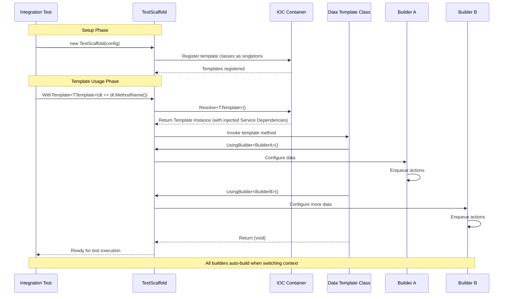

# Data Templates

Data Templates are used to build up the Test Scaffold context with large presets of data.
They allow the use of multiple Builders to build up common data structures using a strongly-typed, compile-time safe approach.

## Overview

The new Data Templates system provides:
- **Compile-time Safety**: No more runtime errors from missing methods or parameter mismatches
- **IOC Integration**: Templates are resolved from the Inversion of Control container
- **Fluent API**: Clean, intuitive API using expression trees
- **Auto-discovery**: Automatic discovery and registration of template classes

## Data Template Workflow



## Creating a Data Template

Data Templates are created by implementing a class marked with the `[DataTemplates]` attribute. Constructor parameters are injected via the IOC container, allowing you to use any services or builders needed for your template logic.

```csharp
[DataTemplates]
public class ApplicationDataTemplates
{
    private readonly TestScaffold _testScaffold;

    public ApplicationDataTemplates(TestScaffold testScaffold, UserBuilder userBuilder, InventoryBuilder inventoryBuilder)
    {
        _testScaffold = testScaffold;
        _userBuilder = userBuilder;
        _inventoryBuilder = inventoryBuilder;
    }

    public void DefaultCatalogueAndUsers()
    {
        _userBuilder.UsingBuilder<UserBuilder>()
            //Setup standard users
            .WithOver18User(out var over18UserId)
            .WithUnder18User(out var under18UserId)
            //Setup User Shopping Carts
            .WithShoppingCart(under18UserId)
            .WithShoppingCart(over18UserId)
            .Build();
        
        _inventoryBuilder.UsingBuilder<InventoryBuilder>()
            //Setup Inventory
            .WithRange(new List<Item>()
            {
                new() {Id = Guid.NewGuid(), Title = Defaults.CatalogueItems.Minions, Price = 21},
                new() {Id = Guid.NewGuid(), Title = Defaults.CatalogueItems.Avengers, Price = 24},
                new() {Id = Guid.NewGuid(), Title = Defaults.CatalogueItems.DeadPool, Price = 14, AgeRestriction = 15}
            }).Build();
        
        _testScaffold.TestScaffoldContext.Set(over18UserId, "Over18UserId");
        _testScaffold.TestScaffoldContext.Set(under18UserId, "Under18UserId");
    }
}
```

### Template Class Structure

- **Attribute**: Use `[DataTemplates]` on the class (not on individual methods)
- **Constructor**: Parameters must be registered with the IOC for IOC injection. This includes the `TestScaffold` itself and any other services or builders you need.
- **Methods**: Template methods should be `void` and use the injected `Servces`
- **Dependencies**: Can inject other services via constructor for complex scenarios

### Advanced Template with Additional Dependencies

For more complex scenarios, you can inject additional services into your template constructor:

```csharp
[DataTemplates]
public class AdvancedDataTemplates
{
    private readonly TestScaffold _testScaffold;
    private readonly MockService _mockService;
    private readonly object _testValue;

    public AdvancedDataTemplates(TestScaffold testScaffold, MockService mockService, object testValue)
    {
        _testScaffold = testScaffold;
        _mockService = mockService;
        _testValue = testValue;
    }

    public void SetupComplexTestEnvironment()
    {
        // Use the injected services
        if (_mockService == null)
            throw new InvalidOperationException("MockService was not injected");

        // Set context using injected services
        _testScaffold.TestScaffoldContext.Set(_mockService.GetType().Name, "InjectedServiceType");
        _testScaffold.TestScaffoldContext.Set(_testValue, "InjectedTestValue");
        
        // Continue with normal template logic
        _testScaffold.UsingBuilder<UserBuilder>()
            .WithOver18User(out var userId)
            .Build();
    }
}
```

## Registering Data Templates

Use the [Auto Discovery](../config-options) feature to register Data Templates automatically:

```csharp
new TestScaffold(new ConfigOptions() 
{
    AutoDiscovery = AutoDiscovery.DataTemplates,
    Assemblies = new List<Assembly> { typeof(ApplicationDataTemplates).Assembly }
})
.UseIoc();
```
This is enabled with the default `ConfigOptions`.

## Using Data Templates

When building the Test Scaffold, you can specify the Data Template to use via the strongly-typed `WithTemplate` method:

```csharp
var testScaffold = new TestScaffold()
    .UseIoc(new DefaultIocAppServicesBuilder(new ConfigOptions(){ 
        // Not required if using default ConfigOptions
        AutoDiscovery = AutoDiscovery.DataTemplates 
    }), ctx =>
    {
        ctx.Container.AddSingleton(_ => TestDbContextFactory.Create());
        ctx.RegisterAppServices();
    })
    .WithTemplate<ApplicationDataTemplates>(dt => dt.DefaultCatalogueAndUsers());
```

### Using WithTemplate

The system provides a simple, flexible API that handles any number of parameters:

```csharp
// No parameters
.WithTemplate<ApplicationDataTemplates>(dt => dt.DefaultCatalogueAndUsers())

// One parameter
.WithTemplate<ApplicationDataTemplates>(dt => dt.SetupUser(userId))

// Multiple parameters
.WithTemplate<ApplicationDataTemplates>(dt => dt.SetupComplexData(param1, param2, param3))
```

### Passing Parameters to Data Templates

You can pass parameters to Data Template methods. The parameters are strongly-typed and validated at compile time:

```csharp
var param1 = 32;
var param2 = Guid.NewGuid();
var param3 = "Hello World";

var testScaffold = new TestScaffold(new ConfigOptions
{
    AutoDiscovery = AutoDiscovery.All,
    Assemblies = new List<Assembly> { typeof(TestScaffoldDataTemplates).Assembly }
})
.UseIoc()
.WithTemplate<TestScaffoldDataTemplates>(
    dt => dt.SetContextFromTemplateMultipleParameters(param1, param2, param3));
```

**Note**: Unlike the old system, the first parameter is no longer required to be a `TestScaffold` object. The `TestScaffold` can be injected via the constructor along with any other service.

## Advanced Usage

### Template Composition

Templates can be composed by injecting other template classes:

```csharp
[DataTemplates]
public class AdvancedSeedTemplates
{
    private readonly SeedDataTemplates _basicTemplates;
    private readonly InventoryBuilder _inventoryBuilder;

    public AdvancedSeedTemplates(SeedDataTemplates basicTemplates, InventoryBuilder inventoryBuilder)
    {
        _basicTemplates = basicTemplates;
        _inventoryBuilder = inventoryBuilder;
    }

    public void SetupPremiumUserWithInventory(Guid userId)
    {
        // Use basic templates
        _basicTemplates.ApplyDefaultCatalogue(userId, Defaults.CatalogueItems.All);
        
        // Add premium features
        _inventoryBuilder.WithPremiumFeatures(userId).Build();
    }
}
```

### Error Handling

The new system provides compile-time safety, eliminating common runtime errors:

- **Method not found**: Compile-time error if method doesn't exist
- **Parameter mismatch**: Compile-time error if parameter count/types don't match
- **Template not registered**: Runtime error if template class isn't in IOC container

## Migration from Old System

If you're migrating from the old reflection-based system:

1. Replace method level attribute `[DataTemplate]` with class level attribute `[DataTemplates]` on the class containing templates
2. Remove `TestScaffold` parameter from template methods
3. Add constructor that takes `TestScaffold` parameter or inject the services directly as a constructor parameter.
4. Update calls from `WithTemplate(string name, params object[] parameters)` to `WithTemplate<TTemplate>(dt => dt.MethodName(param1, param2, ...))`

## Benefits of the New System

- **Compile-time Safety**: No more `MissingMethodException` or parameter count mismatches
- **IntelliSense Support**: Full IntelliSense and refactoring support
- **Type Safety**: Strong typing eliminates runtime type errors
- **Better Performance**: No reflection overhead
- **Easier Testing**: Template classes can be unit tested independently
- **Dependency Injection**: Full IOC integration for complex scenarios
- **Constructor Injection**: Templates can receive additional dependencies beyond TestScaffold
