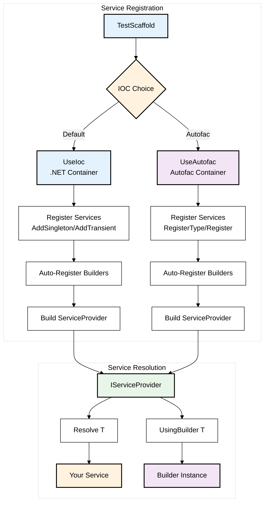
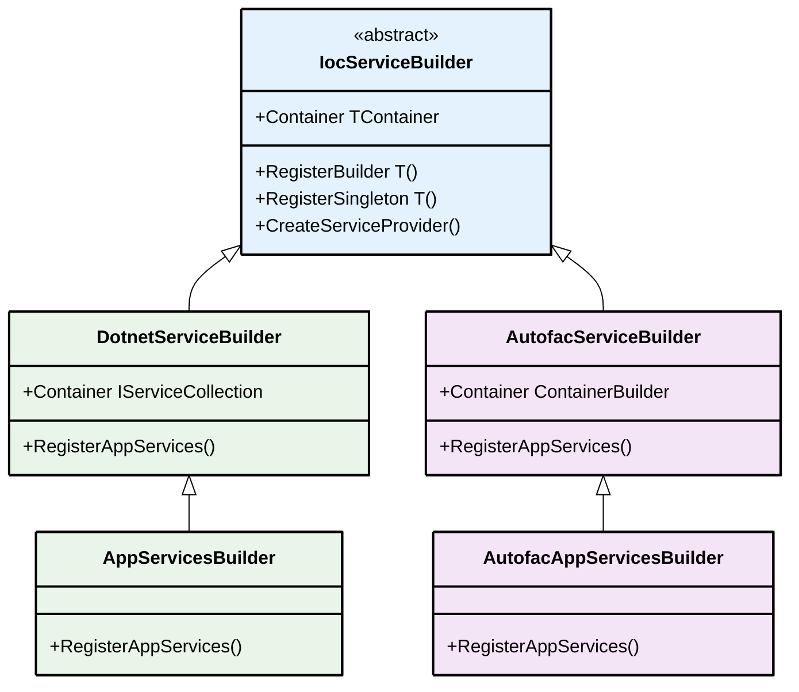

# IOC
Fluent Test Scaffold uses the .Net IOC Container by default to register and resolve builders and their dependencies.

## IOC Container Flow



The IOC can be used to register and construct any services under test.
The container is built after calling UseIoc which takes an optional parameter that exposes a Service Builder.
The Service Builder exposes the underlying IOC's Container Builder & Provides some helpful methods to register Builders. 

## Setup
The default .net IOC implementation requires a reference to `Microsoft.Extensions.DependencyInjection`

```csharp
var testScaffold = new TestScaffold()
    .UseIoc(ctx => ctx.Container.AddSingleton<IMockService, MockService>());
```

## Resolving Services
The `TestScaffold` exposes some helper methods to resolve services from the IOC container
```csharp
var testScaffold = new TestScaffold()
    .UseIoc(ctx => ctx.Container.AddTransient<MockService>());

var service = testScaffold.Resolve<MockService>();

/// or using fluent api

MyService? service = null;
new TestScaffold()
    .UseIoc(ctx =>
    {   ctx.RegisterBuilder<MyBuilder>();
        ctx.Container.AddTransient<MyService>();
    })
    .Resolve<MyService>(out service)
    .UsingBuilder<MyBuilder>();
```

## Mocking Services
Fluent Test Scaffold supports the use of the Mocking Library [Moq](https://github.com/devlooped/moq)

```csharp
var timeService = new TestScaffold()
          .UseIoc(serviceBuilder =>
          {
              serviceBuilder.WithMock<ITimeService>(mock =>
              {
                  mock.Setup(c => c.GetTime()).Returns(TimeOnly.Parse(timeString, CultureInfo.CurrentCulture));
                  return mock;
              });
          })
          .Resolve<ITimeService>();
```

## Autofac Support
To use Autofac for the Ioc container, install `FluentTestScaffold.Autofac` and call `UseAutofac` on the `TestScaffold` to replace the default IOC implementation

```csharp
var testScaffold = new TestScaffold()
    .UseAutofac(ctx =>
    {
        ctx.Container.Register<IAuthService>(_ => mockAuthService.Object).SingleInstance();
        ctx.Container.RegisterType<UserRequestContext>().As<IUserRequestContext>().SingleInstance();
    });
```

## Service Builder
When calling UseIoc, the constructor func injects a Service Builder that wraps the IOC's Container Builder and also exposes some helper methods to Register Builders and the Test Scaffold with the IOC container.

### Container
The container prop exposes the underlying IOC's Container Builder.

```csharp
var testScaffold = new TestScaffold()
       .UseIoc(ctx =>
       {
           ctx.Container.AddSingleton(_ => dbContext);
           ctx.RegisterBuilders(typeof(MockBuilder), typeof(InventoryBuilder));
       });
```

### Custom Service Builders



Custom Service Builders allow you to combine common blocks of registered services making IOC setup simpler.

You can create a custom service builder by inheriting one of the IOC providers Service Builder base classes

* `DotnetServiceBuilder<T>` - .Net's base service builder. (Default IOC)
* `AutofacServiceBuilder<T>` - Autofac's base service builder.

The generic type supplied `T` is the type of your Service Builder and allows for strong typing in the IOC constructor func

#### .Net Service Builder
```csharp
public class AppServicesBuilder : DotnetServiceBuilder<AppServicesBuilder>
{
    public void RegisterAppServices()
    {
        Container.AddSingleton(_ => TestDbContextFactory.Create());
        Container.AddTransient<IUserRequestContext, UserRequestContext>();
        Container.AddTransient<IAuthService, AuthService>();
        Container.AddTransient<ShoppingCart>();
        RegisterBuilder<InventoryBuilder>();
    }
    
}
```

#### Autofac Service Builder

```csharp
public class AutofacAppServicesBuilder : AutofacServiceBuilder<AutofacAppServicesBuilder>
{
    public void RegisterAppServices()
    {
        Container.Register<TestDbContext>(_ => TestDbContextFactory.Create()).SingleInstance();
        Container.RegisterType<UserRequestContext>().As<IUserRequestContext>();
        Container.RegisterType<AuthService>().As<IAuthService>();
        Container.RegisterType<ShoppingCart>();
        RegisterBuilder<InventoryBuilder>();
    }
}
```
#### Usage

To use a custom Service Builder, provide is as a fist parameter to the UseIoc method. 

```csharp
// Default IOC
var testScaffold = new TestScaffold()
     .UseIoc(
         new DefaultIocAppServicesBuilder(),
         ctx => ctx.RegisterAppServices());
     
// Autofac IOC
var testScaffold = new TestScaffold()
         .UseAutofac(
             new AutofacAppServicesBuilder(),
             ctx => ctx.RegisterAppServices()));
```
