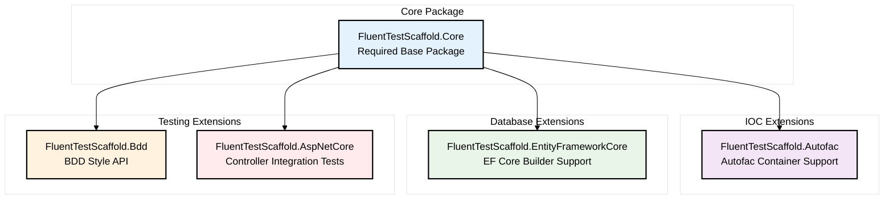

# Setup

## Package Dependencies

Install the core Library.

[Install `FluentTestScaffold.Core`](https://github.com/rburnham52/fluent-test-scaffold/pkgs/nuget/FluentTestScaffold.Core)

### Autofac Ioc support
To enable Autofac ioc Container

[Install `FluentTestScaffold.Autofac`](https://github.com/rburnham52/fluent-test-scaffold/pkgs/nuget/FluentTestScaffold.Autofac)

### Entity Framework Core support
To enable the use of EF core builders.

[Install `FluentTestScaffold.EntityFrameworkCore`](https://github.com/rburnham52/fluent-test-scaffold/pkgs/nuget/FluentTestScaffold.EntityFrameworkCore)

