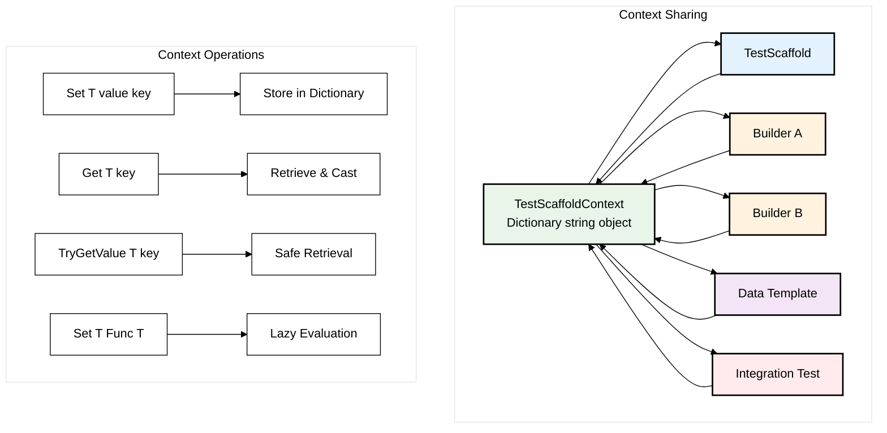

# Test Scaffold Context

The Test Scaffold Context is accessible from the `TestScaffold` and `Builders`.
It allows for storing data between Builders, Data Templates and Tests.

## Context Data Flow




## Using the Context

The Context is accessed via the `TestScaffold` or `Builder` using the `TestScaffoldContext` property or by resolving it from the IOC Container.

### Setting Context From Builders
A custom builder can set the context directly via the `TestScaffoldContext` property or via the `SetTestContext` method

```csharp
        internal MockBuilder Enqueue(string actionName)
        {
            base.Enqueue(_ => AppliedOrder.Add(actionName));
            var hasValue = TestScaffoldContext.ContainsKey("LastAdded");
            
            // Add to context Directly
            if(!hasValue)
                TestScaffoldContext["FirstAdded"] = actionName;
            
            // Add to context with fluent API
            SetTestContext("LastAdded", actionName);
            return this;
        }

```

### Setting Context From Data Templates

Data Templates can set the context using the`SetTestContext` method of a Builder

```csharp
    [DataTemplate]
    public TestScaffold DefaultCatalogueAndUsers(TestScaffold testScaffold)
    {
        testScaffold.UsingBuilder<UserBuilder>()
            //Setup standard users
            .WithOver18User(out var over18UserId)
            .SetTestContext("Over18UserId", over18UserId)
            .WithUnder18User(out var under18UserId)
            .SetTestContext("Under18UserId", under18UserId)
            //Setup User Shopping Carts
            .WithShoppingCart(under18UserId)
            .WithShoppingCart(over18UserId)
            .Build()
            .UsingBuilder<InventoryBuilder>()
            //Setup Inventory
            .WithRange(new List<Item>()
            {
                new() {Id = Guid.NewGuid(), Title = Defaults.CatalogueItems.Minions, Price = 21},
                new() {Id = Guid.NewGuid(), Title = Defaults.CatalogueItems.Avengers, Price = 24},
                new() {Id = Guid.NewGuid(), Title = Defaults.CatalogueItems.DeadPool, Price = 14, AgeRestriction = 15}
            }).Build();
        
        return testScaffold;
    }
```

### Getting Context

Values stored in the Test Context can be accesed from the `TestScaffoldContext` property of the `TestScaffold`

`testScaffold.TestScaffoldContext.Get<Guid>("Over18UserId")`

```csharp
    [Test]
    public void ComponentIntegrationTest_UsingDataTemplates_OverAged()
    {
        var testScaffold = new TestScaffold()
            .UseAutofac(new AutofacAppServicesBuilder(), serviceBuilder =>
            {
                // Custom App Service Builder to register common services. 
                serviceBuilder.RegisterAppServices();
                // Register service under test
                serviceBuilder.Container.RegisterType<ShoppingCartService>();
            })
            .WithTemplate(ApplicationTemplates.DefaultCatalogueTemplate);
        
        // Authenticate user initialised with the DataTemplate
        var requestContext = testScaffold.Resolve<IUserRequestContext>();
        requestContext.AuthenticateUser(UserBuilder.Over18User.Email, UserBuilder.Over18User.Password);
        
        //Resolved the dbContext registered by the AutofacAppServicesBuilder
        var dbContext = testScaffold.Resolve<TestDbContext>();
        var item = dbContext.Items.FirstOrDefault(i => i.Title == Defaults.CatalogueItems.DeadPool);
        
        // Attempt to add age restricted content with under age user
        var shoppingCartService = testScaffold.Resolve<ShoppingCartService>();
        shoppingCartService.AddItemToCart(item!.Id);

        // Get the UserId stored by the DataTemplate
        var userId = testScaffold.TestScaffoldContext.Get<Guid>("Over18UserId");
    
        var cart = dbContext.ShoppingCart.Include(s => s.Inventory).FirstOrDefault(u => u.UserId == userId);
        Assert.IsTrue(cart?.Inventory.Any(i => i.Id == item.Id));
    }
```

Alternatively you can resolve the TestScaffoldContext from the IOC

```csharp
    var contect = testScaffold.Resolve<TestScaffoldContext>();
    var userId = context.Get<Guid>("Over18UserId");
```
